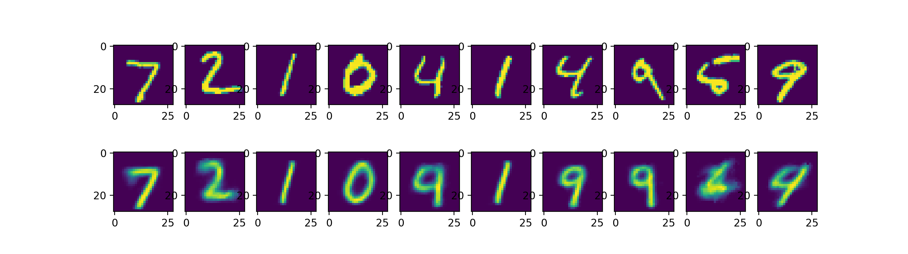
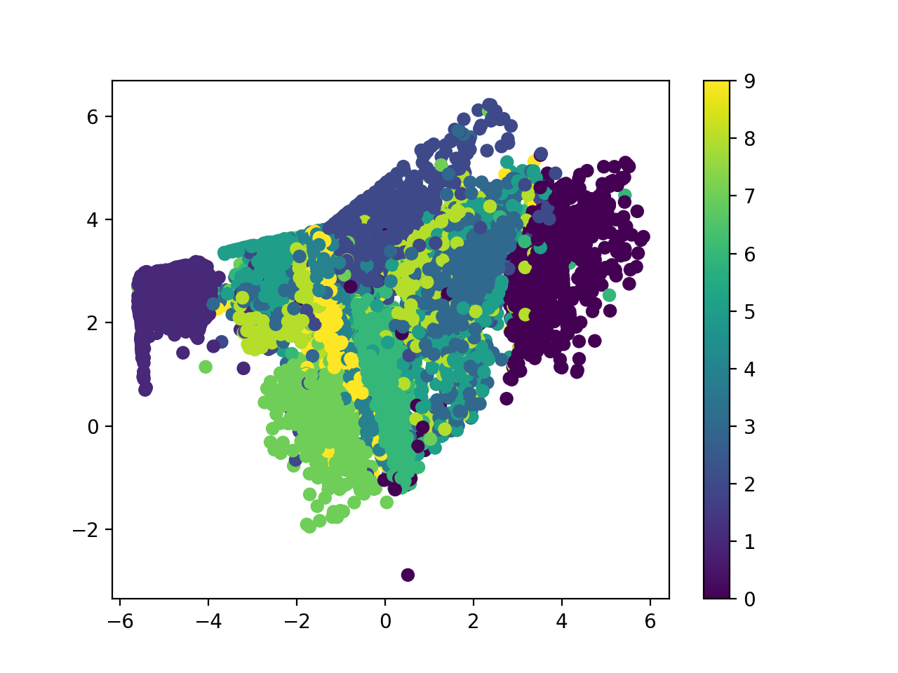
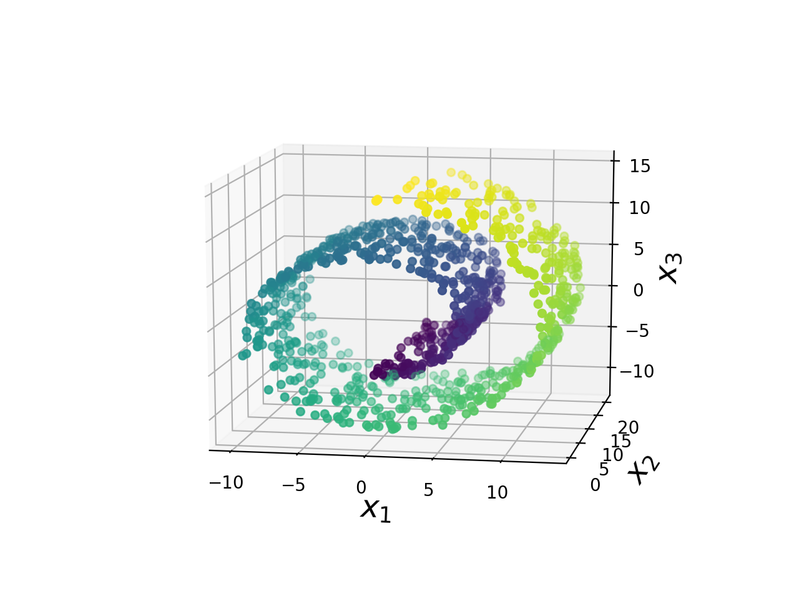
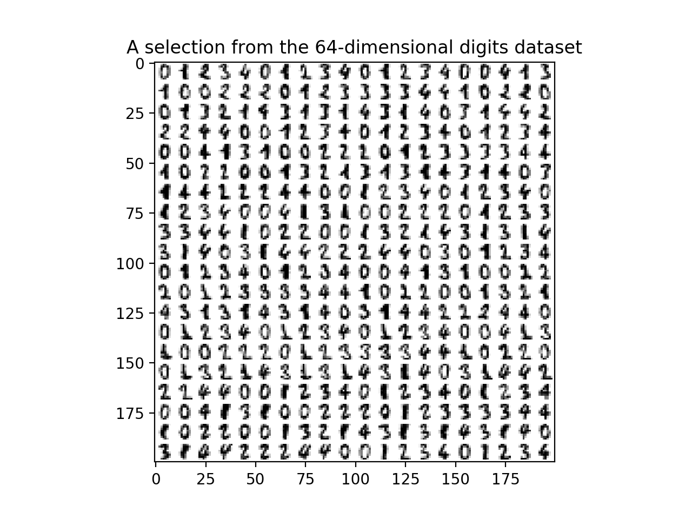
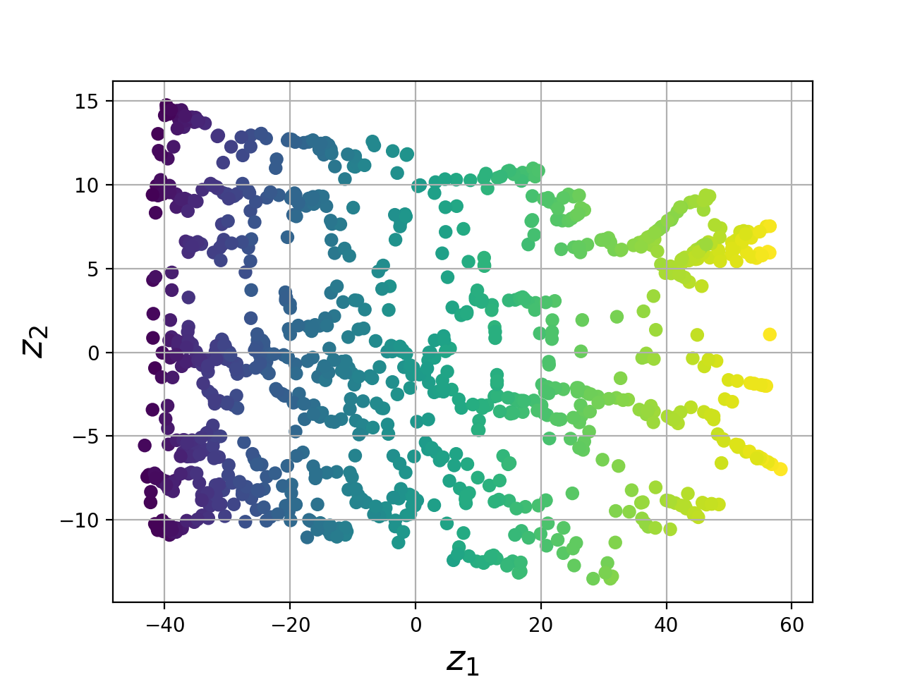
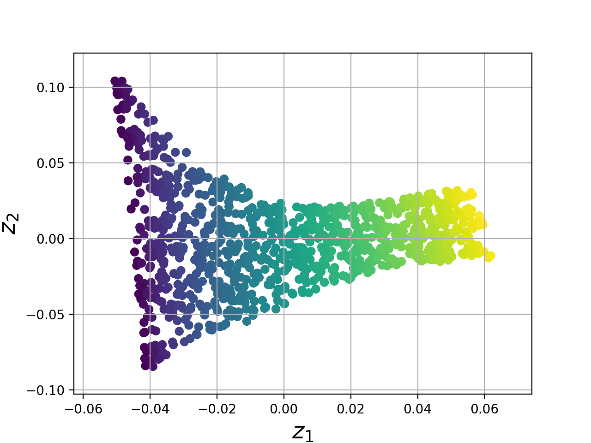
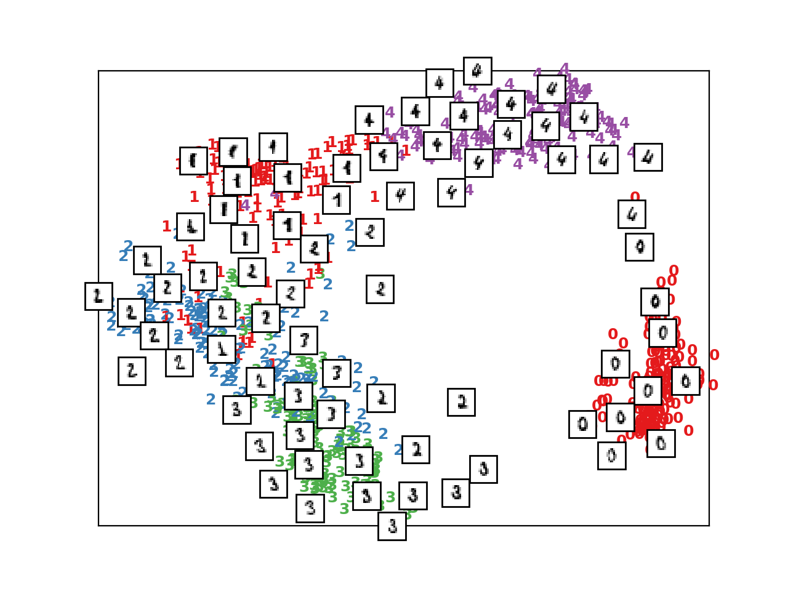
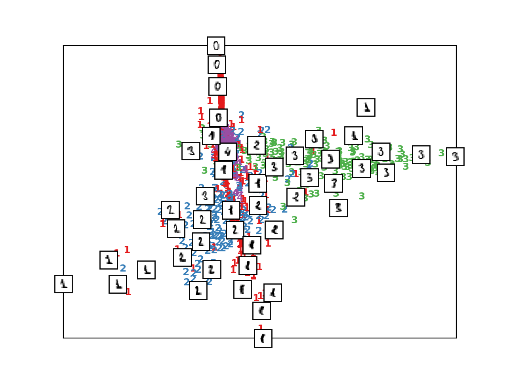

# embedding
### **Graph Representation Learning**

#### 1.文件结构

**embedding**

**—autoencoder**

​    **——ae_for_LPNC**

​    **——ae_for_digits**

**—manifold**

**—other**

#### 2.autoencoder

##### 2.1 ae_for_LPNC

参照源码https://github.com/vuptran/graph-representation-learning，是对论文 [Learning to Make Predictions on Graphs with Autoencoders](https://arxiv.org/abs/1802.08352)的python3代码复现

**1）重构**，以'arxiv-grqc'数据集为例，讨论重构过程，输入输出都是邻接矩阵adj，在50轮的训练后，precisionK到达了全是1的准确率，原论文中precisionK也几乎全是1；

**2）链接预测**，以'conflict'数据集为例，讨论链接预测过程，因为输入只有一张大图，先随机挑选10%的链接作为测试，同时记录其label，再将其训练的真实输出邻接矩阵的测试链接部分值调为-1，输入矩阵对应的部分调为0，这样计算loss的时候，mask会忽略这些测试链接，训练完成后，再输入训练的输入矩阵来预测链接，最后和之前记录的label对比计算准确率。迭代训练50轮后， 测试集的AP: 0.617453，原论文中AP：0.698；

**3）带有节点特征的链接预测**，以'citeseer'数据集为例，讨论带节点特征的链接预测，输入输出操作同上面链接预测，不过带有特征时，就合并特征矩阵为增广矩阵即可。迭代训练50轮后， 测试集的AP: 0.893639，原论文中AP：0.892；

**4）多任务学习，**以'citeseer'数据集为例，讨论多任务过程，还是分出10%的测试集，链接预测同上，对于节点分类，不是所有的节点都有标注，所以也用mask忽略没有标注的节点，其余的就是正常的节点分类过程，softmax预测每个类别的概率，取概率值最高的作为分类结果，和真实的y_true进行比较，整个过程利用多任务loss监督即可，迭代训练100轮后， 测试集的链接预测AP: 0.959978，节点分类ACC：0.642000，原论文中链接预测AP：0.949，节点分类ACC：0.718；

##### 2.2 ae_for_digits

利用简单的自编码器，对mnist数据中的手写数字进行编解码重构

重构结果：

不同数字的编码结果可视化，可以和下面LLE和Isomap对数字降维的节点表示相比较，可视化的结果也表明，两篇论文殊途同归，都是为了学习**节点表示**，即节点嵌入：

#### 3.manifold

瑞士卷流形和数字图片降维，结果如下：

输入

IsomapLLE

IsomapLLE

